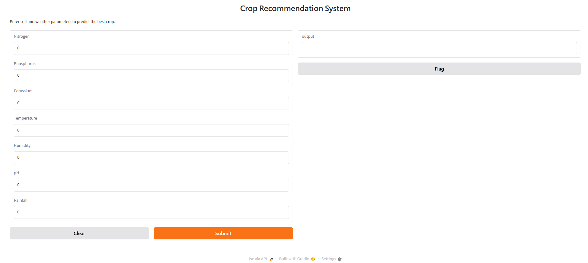
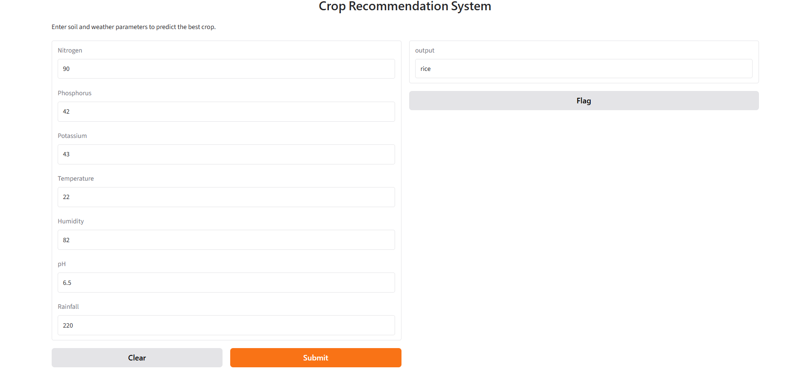

# 🌾 Crop Recommendation System

A machine learning-based system that recommends the most suitable crop to grow based on soil nutrients and environmental conditions.

[](https://www.python.org/)
[](https://scikit-learn.org/)
[](https://gradio.app/)

---

## 📌 Project Overview

Choosing the right crop for a given plot of land is one of the most consequential decisions a farmer makes. Wrong choices waste water, fertilizer, and an entire growing season. This project trains and compares five machine learning classifiers on soil and climate data, then deploys the best-performing model as an interactive web app that returns a crop recommendation from seven input values.

**Input features:** Nitrogen (N), Phosphorus (P), Potassium (K), temperature, humidity, soil pH, rainfall
**Output:** One of 22 crop labels (rice, maize, chickpea, … coffee)

**Best model:** Random Forest Classifier — **99.32% test accuracy**

---

## 📊 Dataset

| Property | Value |
|---|---|
| Source | Kaggle "Crop Recommendation Dataset" |
| File | `data/Crop_recommendation.csv` |
| Rows | 2,200 |
| Columns | 8 (7 features + 1 target) |
| Missing values | 0 |
| Target classes | 22 |
| Class balance | Perfectly balanced — 100 samples per crop |

### Feature ranges

| Feature | Min | Max | Type |
|---|---|---|---|
| N | 0 | 140 | int |
| P | 5 | 145 | int |
| K | 5 | 205 | int |
| temperature | 8.83 | 43.68 | float (°C) |
| humidity | 14.26 | 99.98 | float (%) |
| ph | 3.50 | 9.94 | float |
| rainfall | 20.21 | 298.56 | float (mm) |

The 22 crops are: rice, maize, chickpea, kidneybeans, pigeonpeas, mothbeans, mungbean, blackgram, lentil, pomegranate, banana, mango, grapes, watermelon, muskmelon, apple, orange, papaya, coconut, cotton, jute, coffee.


---

## 🧠 Approach

### 1. Preprocessing
- Loaded with Pandas; verified shape, dtypes, and absence of nulls.
- Separated features (`X`) from target (`y = label`).
- **80/20 train-test split** with `random_state=42` (1,760 train / 440 test).
- Applied `StandardScaler` — fit on the training set only, then applied to the test set to avoid data leakage.

### 2. Models trained
Five classifiers were trained and compared on the same split:

| Model | Test Accuracy |
|---|---|
| Logistic Regression (`max_iter=5000`) | 96.36% |
| K-Nearest Neighbors | 95.68% |
| Support Vector Machine (RBF) | 96.82% |
| Decision Tree | 98.86% |
| **Random Forest** | **99.32%** |

### 3. Final model
The **Random Forest Classifier** was selected for its top accuracy, stability, and strong generalization across all 22 classes. It was retrained on the full training set and used for all subsequent predictions.

### 4. Deployment
A Gradio interface wraps the model. The user enters seven numeric values; the app scales them with the saved `StandardScaler` and returns the predicted crop.

---

## 📈 Results

**Random Forest — 99.32% accuracy on the held-out test set (440 samples).**

The model correctly classified 437 of 440 test samples. Its advantage over the Decision Tree (98.86%) comes from bagging, which reduces the variance that a single tree is prone to.

### Example prediction

```python
predict_crop(N=90, P=42, K=43, temp=22, humidity=82, ph=6.5, rainfall=220)
# → 'rice'
```

---

## 📸 Screenshots

### Interactive Gradio app

The user enters seven soil and climate parameters:



The trained model returns the recommended crop:



### Class balance in the dataset

All 22 crops have exactly 100 samples each, so the model is not biased toward any class:


---

## 📂 Project Structure

```
crop-recommendation-system/
├── README.md
├── requirements.txt
├── code/
│   └── Crop_Recommendation.ipynb    # Full notebook: EDA, training, evaluation, app
├── data/
│   └── Crop_recommendation.csv      # Dataset (2,200 rows, 22 classes)
├── figures/
│   ├── crop_distribution.png
│   ├── gradio_form.png
│   └── gradio_output.png
└── report/
    └── EEE 4710 Project Team Credible.pdf
```

---

## 🚀 How to Run

```bash
# 1. Clone
git clone https://github.com/Alusine-bah/crop-recommendation-system.git
cd crop-recommendation-system

# 2. Install dependencies
pip install -r requirements.txt

# 3. Launch the notebook
jupyter notebook code/Crop_Recommendation.ipynb
```

Or open the notebook in Google Colab and upload `data/Crop_recommendation.csv` to the Colab file panel before running.

---

## 📄 Report

A full write-up of the project — including the problem statement, methodology, model selection rationale, and conclusions — is available in the course report:

**`report/EEE 4710 Project Team Credible.pdf`**
Course: Artificial Intelligence and Machine Learning Lab (EEE 4710)
Islamic University of Technology (IUT), OIC

---

## ⚠️ Limitations

- **Dataset-bound.** The model only knows the ranges it was trained on. Inputs outside those ranges (e.g. pH > 14) produce unreliable predictions.
- **No real-time weather.** Rainfall, temperature, and humidity are user-supplied, not pulled from live sources.
- **No soil-test integration.** Nutrient values must be entered manually.
- **Not field-validated.** Accuracy is measured on a held-out split of the same dataset, not on independent farm trials.

---

## 🌟 Future Improvements

- [ ] Deploy the Gradio app permanently on Hugging Face Spaces
- [ ] Integrate a live weather API so climate inputs update automatically
- [ ] Add soil-test upload / sensor integration
- [ ] Expand the dataset with regional and seasonal variation
- [ ] Experiment with gradient boosting (XGBoost, LightGBM)
- [ ] Add multi-language support for wider accessibility

---

## 👤 Author

**Alusine Bah**
Electrical & Electronics Engineering Student
Islamic University of Technology (IUT), OIC
Passionate about Engineering, AI, and Educational Content

---

## 📜 License

This project is released for educational purposes. The dataset is sourced from Kaggle; please refer to its original license for reuse terms.